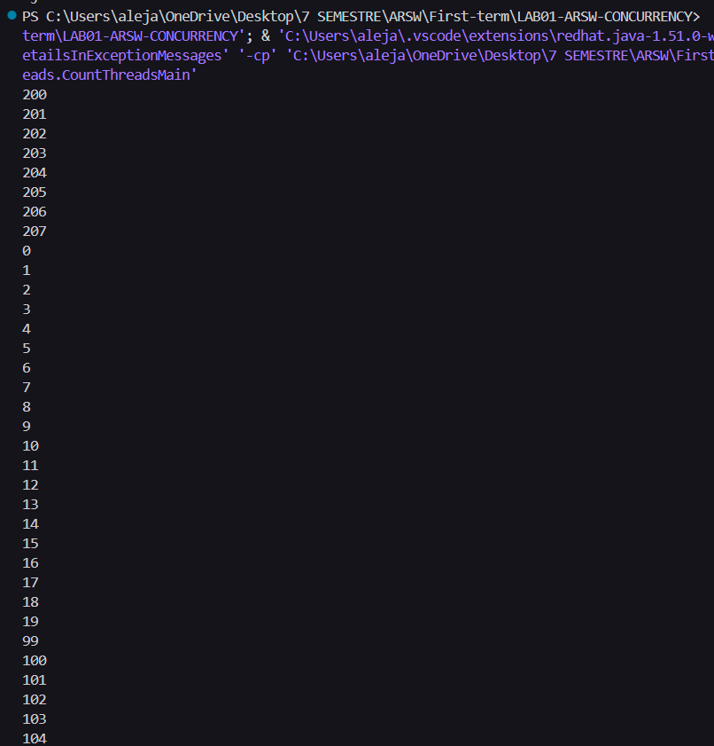
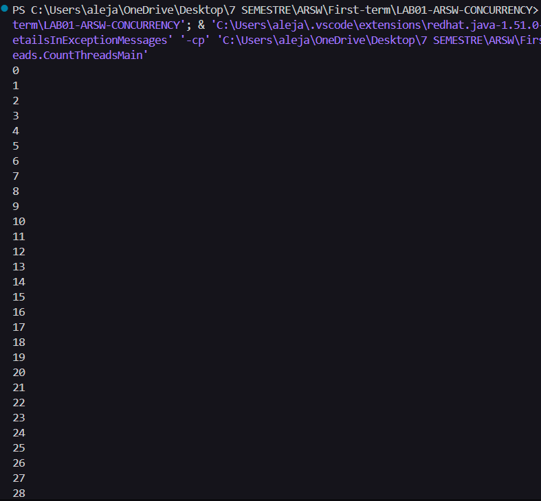
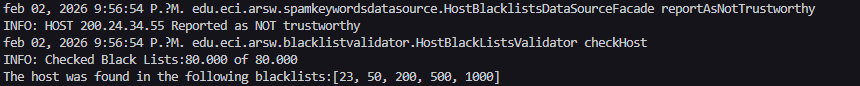
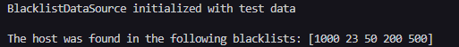
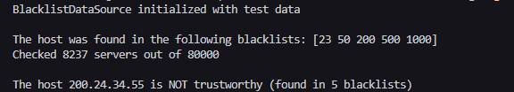
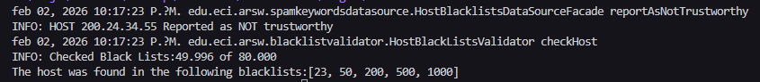
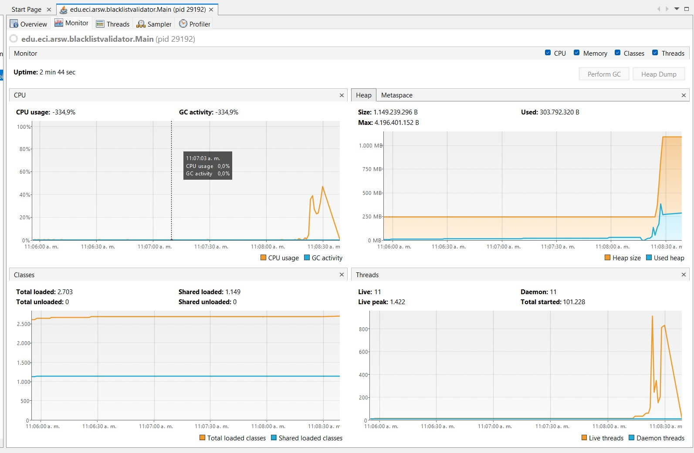
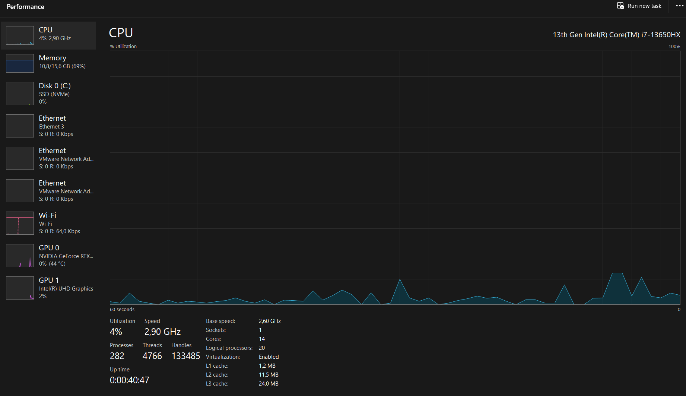
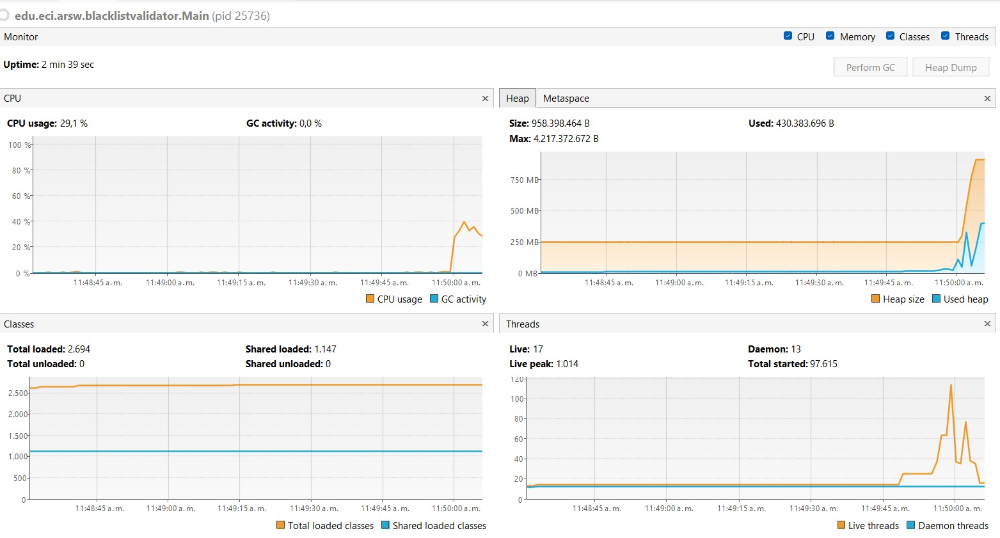
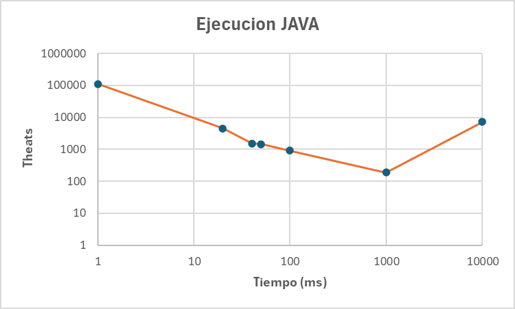

# Laboratorio 1 ARSW - Concurrencia

**Arquitectura de Software**

**Autores:**
- David Alejandro Patacón Henao
- Daniel Felipe Hueso Rueda

---

## Descripción

Este laboratorio explora los conceptos fundamentales de **programación concurrente** mediante la creación de hilos que cuentan números en rangos específicos. El objetivo es entender la diferencia entre ejecución **concurrente** y **secuencial**, implementando la solución en dos lenguajes: **Java** y **Go**.

---

## Parte 1: Implementación de Hilos

### **Objetivo**
Crear 3 hilos que cuenten números en rangos diferentes:
- **Hilo 1:** 0 - 99
- **Hilo 2:** 100 - 199
- **Hilo 3:** 200 - 299

---

## Implementación en Java

### **Estructura del Código**

#### 1. Clase `CountThread.java`

**Características:**
- Extiende la clase `Thread` de Java
- Define rangos mediante los atributos `A` y `B`
- Sobrescribe el método `run()` para ejecutar el conteo

#### 2. Clase `CountThreadsMain.java`

### **Diferencia entre `start()` y `run()`**

#### **Método `start()`**
- **Concurrente:** Crea un nuevo hilo y ejecuta el método `run()` en paralelo
- **Comportamiento:** Los tres hilos se ejecutan simultáneamente
- **Resultado:** Salida intercalada y no ordenada
- **Uso:** Programación multihilo real  

#### **Método `run()`**
- **Secuencial:** Ejecuta el método directamente en el hilo actual (main)
- **Comportamiento:** Los hilos se ejecutan uno tras otro
- **Resultado:** Salida ordenada (0-299 en secuencia)
- **Uso:** No crea hilos nuevos, solo llama al método  

## Implementación en Go

#### 1. **`sync.WaitGroup`**
- Sincroniza la ejecución de goroutines
- `wg.Add(3)`: Indica que esperamos 3 goroutines
- `wg.Done()`: Marca una goroutine como finalizada
- `wg.Wait()`: Bloquea hasta que todas las goroutines terminen

#### 2. **Keyword `go`**
- Lanza una goroutine (equivalente a un hilo en Java)
- Ejecución concurrente automática
- Más eficiente que los hilos tradicionales

#### 3. **`defer wg.Done()`**
- Asegura que `Done()` se ejecute al finalizar la función  

## Análisis de Resultados

### **Ejecución Concurrente con `start()` en Java**

**Observaciones:**
- Los números aparecen intercalados
- No hay orden predecible
- Los tres hilos compiten por la salida estándar
- Demuestra paralelismo real

### **Ejecución Secuencial con `run()` en Java**

**Observaciones:**
- Los números aparecen en orden: 0-99, 100-199, 200-299
- Cada "hilo" termina antes de que comience el siguiente
- No hay concurrencia real, solo llamadas a métodos secuenciales
- Comportamiento similar a un bucle normal

### **Ejecución con Goroutines en Go**

**Observaciones:**
- Salida intercalada similar a `start()` en Java
- Las goroutines se ejecutan concurrentemente
- `WaitGroup` asegura que el programa espere a todas las goroutines
- Mensaje final confirma la terminación de todas

---

## Parte 2: Ejercicio Black List Search

### Descripcion del Problema

El sistema debe validar si una dirección IP aparece en listas negras de servidores de manera concurrente. Se deben revisar 80,000 servidores distribuidos entre N hilos o goroutines, y reportar la IP como sospechosa si aparece en al menos 5 listas negras.

### Implementación en Java

#### Clase BlackListThread

Esta clase extiende `Thread` y se encarga de buscar una IP en un rango específico de servidores. Cada hilo trabaja de forma independiente en su rango asignado y mantiene un contador de servidores revisados y ocurrencias encontradas.

**Atributos principales:**
- `inicio` y `fin`: Definen el rango de servidores a revisar
- `ipaddress`: La IP que se está buscando
- `ocurrencesCount`: Número de veces que se encontró la IP
- `checkedServersCount`: Total de servidores revisados por este hilo

El método `run()` itera sobre el rango asignado, incrementa el contador de servidores revisados en cada iteración, y si encuentra la IP en un servidor, la agrega a la lista de ocurrencias.

#### Clase HostBlackListsValidator

Es el coordinador principal que distribuye el trabajo entre los hilos. Calcula cuántos servidores debe revisar cada hilo dividiendo el total entre N, y distribuye el resto(en los casos en donde N es impar)uniformemente entre los hilos para balancear la carga.

**Estrategia de distribución:**
Si hay 80,000 servidores y 4 hilos, cada hilo recibe exactamente 20,000 servidores.

Si hay 80,000 servidores y 3 hilos, cada hilo recibe aproximadamente 26,666 servidores(26,666*3 = 79,998) quedan sobrando 2 servidores. Los 2 servidores restantes se distribuyen dando uno extra a cada uno de los primeros 2 hilos.

Una vez creados los hilos, el método usa `join()` para esperar a que cada uno termine y luego recopila los resultados acumulando las ocurrencias y servidores revisados. Finalmente, si se encontraron 5 o más ocurrencias, reporta la IP como no confiable.

#### Clase Main

Crea una instancia del validador, especifica el número de hilos a utilizar y ejecuta la búsqueda para una IP específica.

### Implementación en Go

#### Archivo validator.go

Define la estructura `Validator` que coordina las goroutines y la estructura `SearchResult` que empaqueta los resultados de cada búsqueda.

El método `CheckHost` calcula la distribución de servidores por goroutine de forma similar a Java, lanzando N goroutines con la palabra clave `go`. Utiliza un `WaitGroup` para sincronizar la ejecución y un canal con buffer para recopilar los resultados.

Cada goroutine ejecuta la función `searchInRange`, que busca en su rango asignado y envía los resultados al canal. Al finalizar, el método principal recopila todos los resultados del canal y retorna la lista de servidores donde se encontró la IP.

#### Archivo datasource.go

**Nota:Este metodo fue generado por AI para simular la funcionalidad de la clase Java HostBlacklistsDataSourceFacade**
Implementa un Singleton usando `sync.Once` que simula la fuente de datos de listas negras, equivalente a la clase Java `HostBlacklistsDataSourceFacade`.

#### Archivo main.go

Crea el validador, especifica el número de goroutines y ejecuta la búsqueda para una IP de prueba.

### Comparación entre Java y Go

**Concurrencia:**
- Java usa hilos del sistema operativo creados con la clase `Thread` y el método `start()`
- Go usa goroutines que son más ligeras y se crean con la palabra clave `go`

**Sincronización:**
- Java espera a cada hilo individualmente usando `join()`
- Go usa `WaitGroup` para esperar a todas las goroutines como grupo

**Comunicación:**
- Java recopila resultados llamando getters después de `join()`
- Go usa canales para enviar resultados de forma concurrente

**Distribución de carga:**
Ambas implementaciones usan la misma estrategia de distribuir el resto uniformemente entre los hilos/goroutines para optimizar el balanceo de carga.

### Aspectos Técnicos Clave

**Balanceo de carga:** La distribucion uniforme del resto evita que un hilo termine mucho después que los demás, optimizando el tiempo total de ejecucion.

**Thread safety:** Cada hilo opera en un rango exclusivo de servidores, eliminando condiciones de carrera.

### Ejemplo de Ejecucion en Java

### Ejemplo de Ejecucion en Go

---

## Parte 2.1: Optimización - Detención Temprana

### Problema de Ineficiencia

La implementación actual presenta una limitacion: todos los hilos continuan buscando en sus rangos asignados incluso después de que colectivamente ya se han encontrado las 5 ocurrencias mínimas necesarias para reportar la IP como maliciosa. Esto significa que si las primeras ocurrencias se encuentran rápidamente, se siguen revisando innecesariamente miles de servidores adicionales.

**Ejemplo del problema:**
Si con 100 hilos las 5 ocurrencias se encuentran en los primeros 1,000 servidores, los 79,000 servidores restantes se siguen revisando de todas formas.

### Solución Propuesta: Detención Temprana

La optimización consiste en implementar un mecanismo que permita detener todos los hilos tan pronto como se alcance el umbral de 5 ocurrencias. Esto requiere:

**1. Variable compartida para el contador global de ocurrencias**

Los hilos deben poder consultar en tiempo real cuantas ocurrencias se han encontrado en total. Esto requiere una variable compartida accesible por todos los hilos.

**2. Sincronización del acceso a la variable compartida**

Como múltiples hilos leerán y modificarán el contador simultáneamente, se necesita sincronización para evitar condiciones de carrera. Las solciones para lenguaje son:

- **Java:** utilizar `AtomicInteger` para manejar el acceso a la variable compartida, en cada servidor encontrado se incrementa atomícamente. En cada iteración, el hilo verifica si el contador ha alcanzado el umbral necesario.

- **Go:** Usar `atomic` para proteger el acceso a la variable compartida. Cada goroutine incrementa el contador atómicamente y verifica su valor antes de continuar.

**3. Verificación periódica dentro del ciclo de búsqueda**

Cada hilo debe verificar regularmente si el contador global ha alcanzado 5 o la cantidad especificada de ocurrencias. Si es así, debe terminar su búsqueda inmediatamente.

**4. Notificación entre hilos**

Cuando un hilo encuentra una ocurrencia, debe actualizar el contador compartido y notificar a otros hilos que se alcanzó el límite.

### Nuevos Elementos que Introduce

**Variables compartidas:**
Ahora se requiere estado compartido entre hilos.

**Condiciones de carrera:**
Múltiples hilos accediendo y modificando la misma variable pueden causar inconsistencias si no se sincronizan correctamente.

**Overhead de sincronización:**
Verificar el contador compartido repetidamente y usar mecanismos de sincronización añade costo computacional. 

**Complejidad del código:**
La lógica se vuelve más compleja al manejar sincronización, verificaciones adicionales y terminación temprana de hilos.

**Ventajas:**
- Reduce el número de consultas cuando las ocurrencias se encuentran temprano
- Mejora el tiempo de respuesta en casos favorables
- Ahorra recursos de procesamiento

**Desventajas:**
- Mayor complejidad del código
- Posible contención si muchos hilos acceden al contador simultáneamente
- Requiere diseño cuidadoso para evitar errores de concurrencia

### Ejecución de la Optimización
En este caso se implementó la optimización tanto en Java como en Go, utilizando `AtomicInteger` en Java y `atomic` en Go para manejar el contador global de ocurrencias.

### Ejemplo de ejecucion Optimizada en Go

### Ejemplo de ejecucion Optimizada en Java

---

## Parte 3: Análisis de Rendimiento

### Configuración del Sistema de Pruebas
- **IP de prueba:** 202.24.34.55
- **Servidores totales:** 80,000

### Especificaciones tecnicas del equipo: ASUSU ROG Strix G15
- **Procesador:** 13th Gen Intel(R) Core(TM) i7-13650HX (2.60 GHz) (20 Cores)
- **RAM:** 16,0 GB  
- **Grafica:** NVIDIA GeForce RTX 4060

### Ejecucion de solucion en java
| Hilos | Tiempo (ms) | 
|-------|-------------|
| 1 | 111,472 |
| 20 | 4,495 |  
| 40 | 1,509 |  
| 50 | 1,461 | 
| 100 | 919 | 
| 1000 | 186 |
| 100000 | 7,149 | 

## Resultados de visualVM  

### Ejecucion de solucion en go
| Goroutines | Tiempo (ms) |
|-------|-------------|
| 1 | 11 |
| 20 | 20 |  
| 40 | 10 |  
| 50 | 9 | 
| 100 | 12 | 
| 1000 | 17 |
| 100000 | 40 | 

## Resultados de Task Manager

### Especificaciones tecnicas del equipo 2: MSI 15C 
- **Procesador:** 13th Gen Intel(R) Core(TM) i5-13420HX (2.10 GHz) (12 Cores)
- **RAM:** 16,0 GB  
- **Grafica:** NVIDIA GeForce RTX 4060

### Ejecucion de solucion en java
| Hilos | Tiempo (ms) | 
|-------|-------------|
| 1 | 142,222 |
| 12 | 6,743 |  
| 24 | 1,595 |  
| 50 | 1,551 | 
| 100 | 993 | 
| 1000 | 206 |
| 100000 | 6,704 | 

### Resultados de visualVM  

### Ejecucion de solucion en go
| Goroutines | Tiempo (ms) |
|-------|-------------|
| 1 | 8 |
| 12 | 13 |  
| 24 | 6 |  
| 50 | 15 | 
| 100 | 15 | 
| 1000 | 20 |
| 100000 | 34 | 

### Resultados de Task Manager

---

### Análisis Comparativo de Resultados

#### Comparación entre Equipos (Java)

**Equipo 1 (20 cores) vs Equipo 2 (12 cores):**

- **1 hilo:** ASUS (111,472 ms) es 27% más rápido que MSI (142,222 ms) - la velocidad de reloj superior (2.60 GHz vs 2.10 GHz) hace la diferencia
- **Núcleos nativos:** ASUS con 20 hilos (4,495 ms) vs MSI con 12 hilos (6,743 ms) - el ASUS es 33% más rápido aprovechando más núcleos
- **1000 hilos (óptimo):** Ambos equipos tienen rendimiento similar - ASUS (186 ms) vs MSI (206 ms) - solo 10% de diferencia
- **100,000 hilos:** Sorprendentemente, el MSI (6,704 ms) maneja mejor la sobrecarga que el ASUS (7,149 ms)

**Observación clave:** Con paralelismo moderado-alto, las diferencias de hardware se minimizan.

#### Comparación entre Lenguajes

**Java vs Go - Diferencias dramáticas:**

| Configuración | Java (mejor caso) | Go (ASUS) | 
|---------------|-------------------|-----------|
| 1 hilo/goroutine | 111,472 ms | 11 ms |
| Óptimo (1000) | 186 ms | 17 ms | 
| Sobrecarga (100k) | 7,149 ms | 40 ms |

**¿Por qué Go es superior?**

1. **Goroutines son más ligeras:** Consumen ~2KB vs ~1MB por hilo en Java
2. **Scheduler más eficiente:** Go maneja millones de goroutines sin degradación significativa
3. **Overhead mínimo:** No hay sobrecarga del sistema operativo al crear goroutines
4. **Mejor para I/O-bound:** El runtime de Go es optimizado para operaciones concurrentes de I/O

#### Conclusiones

1. **Go es claramente superior** - tiempos consistentemente 10-100x más rápidos que Java

2. **El número de núcleos importa hasta cierto punto** - Con 1000 hilos, equipos con diferente número de cores tienen rendimiento similar

3. **Más hilos no siempre es mejor** - Java se degrada con 100,000 hilos, mientras Go mantiene buen rendimiento

4. **Go escala mejor** - Puede manejar 100,000 goroutines en 40ms, mientras Java necesita 7 segundos

5. **El punto óptimo en Java (1000 hilos)** balancea concurrencia y overhead, pero Go no necesita este balance - funciona bien con cualquier cantidad de goroutines  

Para aplicaciones concurrentes con operaciones intensivas, Go ofrece ventajas significativas sobre Java en términos de 
rendimiento y eficiencia de recursos.

### Gráfica de Rendimiento
El rendimiento muestra una mejora hasta aproximadamente 1000 hilos, seguida de una degradación drástica al exceder ese punto óptimo. Esto ilustra la importancia de encontrar el balance correcto entre concurrencia y overhead del sistema.  
  

---

## Parte 4 - Preguntas sobre la Ley de Amdahl

### 1. ¿Por qué el mejor desempeño no se logra con 500 hilos? ¿Cómo se compara con 200?

Según nuestros resultados, el mejor desempeño se logró con **1000 hilos (186 ms)**, no con 500. Sin embargo, cuando llegamos a **100,000 hilos (7,149 ms)** el rendimiento se degrada drásticamente.

**Razón principal:** Aunque la Ley de Amdahl predice mejoras con más hilos, en la práctica hay un punto donde el **overhead** (costo) de crear y gestionar tantos hilos supera los beneficios. 

Con 500 o 200 hilos todavía hay mejora porque:
- El overhead de gestión es relativamente bajo
- Los hilos pueden aprovechar los tiempos de espera
- El sistema aún puede manejarlos eficientemente

Pero después de cierto punto (en nuestro caso, más allá de ~1000), el sistema gasta más tiempo:
- Cambiando de contexto entre hilos
- Asignando memoria para cada hilo
- Sincronizando el acceso a recursos compartidos

**Comparación:** 200 hilos sería más lento que 1000 pero más rápido que 100,000, ya que aún no alcanza el punto de saturación del sistema.

---

### 2. ¿Cómo se comporta la solución usando tantos hilos como núcleos (20) comparado con el doble (40)?

Según nuestros resultados:
- **20 hilos (igual a núcleos):** 4,495 ms
- **40 hilos (doble de núcleos):** 1,509 ms

**Observación:** Usar el **doble de hilos mejora el rendimiento ~3 veces** (4495/1509 ≈ 2.98x)

**¿Por qué funciona mejor con más hilos que núcleos?**

Porque esta tarea es **I/O-bound** (limitada por entrada/salida):
- Cuando un hilo espera respuesta de un servidor (I/O), el núcleo queda libre
- Otro hilo puede usar ese núcleo mientras tanto
- Con solo 20 hilos, hay momentos donde los núcleos están ociosos esperando I/O
- Con 40 hilos, hay más trabajo disponible para mantener los núcleos ocupados

---

### 3. ¿La Ley de Amdahl se aplicaría mejor con 1 hilo en 100 máquinas? ¿Y con c hilos en 100/c máquinas?

#### a) 1 hilo en cada una de 100 máquinas:

**Sí, la Ley de Amdahl se aplicaría mejor**, porque:
- Eliminamos el overhead de gestión de múltiples hilos en una sola máquina
- Cada máquina tiene sus propios recursos (CPU, memoria, caché)
- No hay contención por recursos compartidos
- La comunicación entre máquinas sería mínima (solo para reportar resultados)

**Limitación:** Depende de la latencia de red y la coordinación entre máquinas.

#### b) c hilos en 100/c máquinas distribuidas:

**Sí, esto sería aun mejor**, porque:

Ejemplo con 20 núcleos por máquina (c=20):
- Usaríamos 20 hilos en 5 máquinas (100/20 = 5)
- Cada máquina usa sus hilos de manera óptima (c hilos = c núcleos)
- Reducimos el overhead de tener demasiados hilos en una sola máquina
- Mantenemos la distribución del trabajo

**Ventajas:**
1. **Balance ideal:** Cada máquina usa exactamente sus núcleos disponibles
2. **Menos overhead:** No hay exceso de hilos compitiendo por recursos
3. **Escalabilidad:** Más fácil escalar agregando más máquinas
4. **Aislamiento:** Un problema en una máquina no afecta a las demás

**Conclusión:** La combinación **c hilos × 100/c máquinas** aprovecha mejor el paralelismo porque:
- Distribuye la carga sin saturar ninguna máquina individual
- Cada máquina opera en su punto óptimo de eficiencia
- Se minimiza tanto el overhead de hilos como el de coordinación de red

